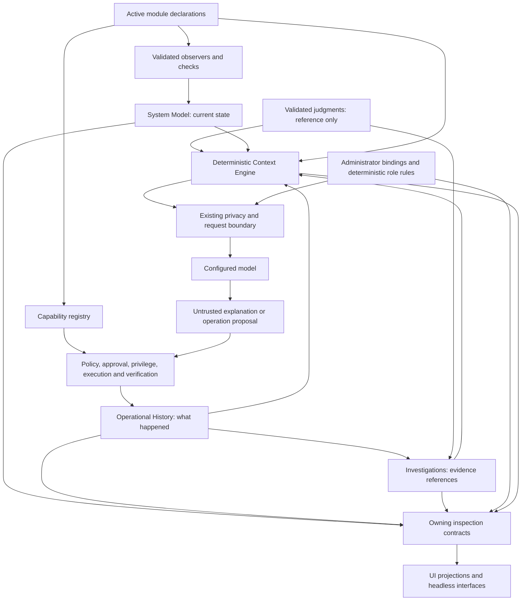

# Architecture integration review and readiness assessment

Reviewed on 2026-10-01 against local `igor2` commit `d6229f0`, after 15B,
D055, 15UI, 15C and 15D. The checkout was clean at review start.

**Assessment:** the bounded foundations compose without giving AI or the UI
operational authority. They support further interface consolidation now. They
do not yet prove readiness to make the TUI the default for normal system and
application administration. Configuration ownership and a representative
application workflow remain the principal integration gaps.

This is the requested “Step 16” review, not implementation or completion of
the roadmap's [Step 16 — Baselines](ROADMAP.md#step-16--baselines--future).
It accepts no new architecture, changes no roadmap status and authorizes no
later work. Code, configuration and existing documentation were only read;
this report is the sole deliverable. Existing test evidence is attributed to
[STATUS.md](STATUS.md), not presented as tests rerun during this review. No
live-provider, terminal usability, remote Git freshness or deployment test was
performed. Recommendations below require their own owner-scoped work.

## 1. Current architecture map

| Component | Owned meaning and implemented boundary | Inspection and limits |
|---|---|---|
| System Model | Current structured facts keyed by object, property and state class; separate responsibility, source, owner, availability and expiry. Validated observers publish observed facts; named source adapters publish intent/inference. | `--model` exposes facts, observers and health. Runtime snapshots are process-local, not a general durable inventory. The implemented memory domain is narrower than the target inventory. |
| Operational History | Durable canonical capability attempts, frozen inputs, authority metadata, execution, verification, outcomes and interruption/reconciliation evidence. | `--history` queries versioned records. SQLite is private. Explicit recovery may query a matching verifier; inspection never executes, refreshes or retries. Legacy raw/v1 operations retain the command journal. |
| Investigations | Durable local questions, lifecycle, hypotheses, supporting/contradicting evidence, validated judgment attachments, findings and uncertainty. | Python/headless data operations and a read-only panel. Private atomic JSON; scope comes through History's service. Findings remain investigation-scoped. |
| Judgment Contract | Bounded model interpretation, exact input/reference binding, invocation provenance, abstain/unknown, validation and failure/fallback distinctions. | In-memory interface and validators; attachments expose records. No production live-provider judgment generation or dedicated live judgment feed. |
| Context and role routing | Eligible reference candidates, bounded deterministic selection, optional validated within-tier ranking and administrator-owned model bindings. | CLI preview/latest retained decision and the 15UI projection show inclusion/exclusion and role rule/reason. Provenance is operational metadata, not durable knowledge. |
| Interaction Surface | Session presentation, scrolling/focus/selection, bounded inspection rendering and typed value proposals. | Existing TUI/PTY/backend events. AI settings are the concrete editable integration. No generic configuration writer or subsystem authority lives in the UI. |
| Capabilities, policy and privilege | Active provider resolution, input/precondition validation, deterministic READ/CHANGE/DESTROY policy, approval, exact privileged execution and verification. | Shared catalog/inspection and bounded structured plans. The actual memory READ is canonical; service CHANGE coverage is an isolated fixture, not an application migration. |
| Domain events and automation | Separate transient operational signals and durable operator-enabled scheduling/claims. | Existing inspection; unattended execution is bounded unprivileged READ. Neither frontend events nor learned evidence activates automation. |

Arrows express consumption, not delegation of authority. Judgment arrows are
conditional consumers of supplied records, not automatic model calls. AI output
cannot write facts, refresh observations, register operations or bypass policy.
Operational capability providers and AI inference providers are different
registries and meanings, even though both use the word “provider.”

Primary evidence: [Architecture](ARCHITECTURE.md), [D033–D057](DECISIONS.md),
[System Model](../../core/lib/system_model.py),
[observer boundary](../../core/lib/observation.sh),
[capability lifecycle](../../core/lib/capability.sh),
[Operational History](../operational_history.md),
[Investigations](INVESTIGATIONS.md), [Judgments](JUDGMENT_CONTRACT.md),
[Context Routing](CONTEXT_ROUTING.md) and
[Interaction Surface](INTERACTION_SURFACE.md).

## 2. Completed foundations

The completed milestones are bounded contracts, not full implementations of
every target architecture layer.

- **15B:** durable pre-effect identity, canonical lifecycle hand-offs, interruption
  uncertainty, explicit verification-only reconciliation, inspection and versioned
  export/restore/reset. History does not depend on frontend/domain event delivery.
- **D055:** provider-neutral judgment request/result envelope, injected tool-free
  adapter, validation and deterministic fallback. Schema validity is not truth.
- **15UI:** extends the existing TUI rather than creating another interaction
  runtime; preserves backend approvals, pending choices and native sudo PTY input.
- **15C:** durable investigation lifecycle and validated attachments with scoped
  references, bounded private persistence and recovery. No finding-to-fact path.
- **15D:** extends the existing Context Engine and request boundary; deterministic
  eligibility/budgets, explicit evidence selection, three roles and inspectable
  routing/context decisions. No context database or automatic ranking invocation.

The earlier active-owner module index, host-memory observer/check, canonical
capability dispatcher, structured plans, domain bus and READ-only automation
provide real integration seams. [STATUS](STATUS.md) records contract,
regression, vertical-slice, inspection and migration/recovery evidence under
[EXECUTION](EXECUTION.md). Its 15D gate includes 388 Python tests plus 321
subtests, affected validation after a provenance correction, and corrected
Bash assertions. It also records baseline lint debt and the whole-file
`core.sh` ShellCheck resource limitation. These are inherited evidence and
limitations, not new review validation or proof of default-TUI readiness.

## 3. Remaining gaps

### Architecture composition and ownership

| Finding | Current evidence | Consequence |
|---|---|---|
| Canonical coverage is incomplete | [LEGACY](LEGACY.md), [capabilities](../../core/lib/capability.sh), v1 Nextcloud actions and Diagnose/recovery callers | History's canonical guarantees do not cover every menu, raw shell or v1 workflow. Audit, journal and chat remain different records, not interchangeable operational truth. |
| Current-state reuse is domain- and process-bounded | [observation.sh](../../core/lib/observation.sh) creates a private runtime file; [health_runner.sh](../../core/lib/health_runner.sh) can ensure required facts are fresh | A separately spawned CLI process cannot be assumed to share the live session's facts. Future inspection must preserve snapshot ownership/time and distinguish querying from refresh. Other domains still perform direct probes. |
| Persistence references share identity but not one store | [InvestigationService](../../core/lib/investigations.py) uses History status/ensure_scope and requires matching scope on restore | This is intentional service coupling. Restore order and unavailable/pruned targets must remain visible; resetting one store must not be interpreted as resetting all memory. |
| Configuration and secret ownership are distributed | [config_loader.sh](../../core/lib/config_loader.sh), [config.sh](../../core/lib/config.sh), [helpers.sh](../../core/lib/helpers.sh) | Multiple loaders, direct application paths and environment exports remain migration inputs; no universal effective-value/source inspector or mediated setting writer exists. |
| Inspection consolidation is incomplete | [panel_sections](../../core/ai/tui.py) currently exposes session, AI, settings, history, investigations, routing and latest result | Modules, facts, capabilities, plans and automation have backend surfaces but are not all dedicated panel sections. Bounded recent/list views do not replace full record inspection. |

These are coverage and coupling gaps. The review found no intentional authority
transfer from History, Investigations, judgments or context decisions into
execution policy. This is a code/document review finding, not a new security
certification. Reviewed local modules are executable trusted code; owner tags
and isolated handler processes do not sandbox an untrusted module.

### AI flow, roles and judgments

The shared production path is `_nexus_api_call`/`_nexus_api_call_raw` →
`_ai_prepare_transport` → provider adapter/router → `ai_engine.mode_call` →
`request_boundary.prepare` → HTTP. Direct engine calls also validate routing.
Implemented transports accepted here are Anthropic, OpenRouter and Ollama;
an OpenAI-named engine directory/proposal is not proof of a working transport.
See [api.sh](../../core/ai/api.sh), [ai_engine.py](../../core/ai/ai_engine.py),
[role_transport.py](../../core/ai/role_transport.py) and
[request_boundary.py](../../core/ai/request_boundary.py).

| AI usage | Role/context/judgment coverage today |
|---|---|
| Ordinary conversation, continuation, retry and tool follow-up | Default `conversation` rule selects reasoner. With `IGOR_REFERENCE_V1`, the boundary selects reference candidates, explicit scoped evidence and read-only runtime snapshots. Minimal policy suppresses reference resolution. No D055 envelope wraps ordinary conversational/tool responses; existing transaction/tool validation remains their boundary. |
| Foreground conversation compaction | Explicit `summarize` request in [core.sh](../../core/ai/core.sh), tool-free summarizer, own excerpt only, existing transaction-safe failure fallback. No judgment output contract. |
| Session-log and WIP summaries | [knowledge.sh](../../core/ai/knowledge.sh), `_ai_knowledge_save_log_entry` and `_ai_knowledge_save_wip`, still call the shared API without the summarizer/text-only tags. They default to reasoner and export vendor-specific summary model guesses. Without an explicit reasoner binding those exports become the inherited primary model. They do not receive the same explicit helper-role isolation as compaction. This is an uneven migration, not a second gateway or evidence of unauthorized execution. |
| Optional relevance ranking | [select_request_context](../../core/ai/context_engine.py) accepts a supplied D055 record bound to the exact request/digest. It may reorder optional candidates within policy tiers; abstain, invalid or low-confidence records retain deterministic selection. No production caller automatically invokes `context_ranker`. |
| Investigation judgments | [investigations.py](../../core/lib/investigations.py) validates attachments; [request_context.py](../../core/ai/request_context.py) revalidates them as reference candidates when an investigation is explicitly selected. No live judgment generation or recursive evidence collection. |
| Local commands/inspection | Handled locally. Recognized role rules are contracts, not proof that every request type has a live caller; ordinary operational conversations still generally use the default reasoner rule. |

Role selection is inspectable with rule/reason, binding and constraints.
`prepared` means a request was assembled, not that its provider succeeded.
Invocation outcomes require the correlated response/audit evidence. Availability
is administrator configuration, not a health probe. Retention depends on the
existing optional audit; `--context last` may return `not_recorded`. Early
preparation failures do not all emit a new full selection record, so a previously
displayed decision must not be taken as the outcome of every later request.

Legacy live `ai_context` hooks/probes and labeled aggregate categories remain
outside migrated domains. Assembly depends on shell environment snapshots and
the renderer's reference marker. Arbitrary prompts without that marker are
still routed/scrubbed but do not resolve machine/investigation references.
The policy is explicit; universal semantic relevance extraction, judgment
transport and helper-role coverage are not implemented. Broader role ideas in
[MODEL_ROLES](MODEL_ROLES.md) and [AI_SPECIALISTS](AI_SPECIALISTS.md) remain
proposals, not enabled routes.

### Configuration and property foundation

| Value class | Location/owner today | Missing generic contract |
|---|---|---|
| Secrets | Ignored `secrets/*.env` and `.key`, some legacy root-file fallbacks; loader, scrubber and declared module secret metadata | Central reference/value-access mediation is incomplete; permission checks in `_cfg_source_env` warn and continue. No generic secret UI editor or complete access-audit service. |
| Paths | `IGOR_DIR`, relocation environment variables, `_igor_resolve_dir`, plus direct module/application paths | Unified ownership/portability and migration mapping. Defaults disagree for some legacy knowledge/pattern paths. |
| Environment variables | Committed `config/variables/*.env`, core defaults, secret overrides and deprecated root env files, exported into the current shell | Canonical identity, types, effective source/scope and validated merge/write boundaries. Shell sourcing remains executable configuration. Deprecated files load later and may override earlier values. |
| Runtime configuration/state | Session AI settings, disposable `data/runtime`/temporary snapshots, subsystem stores and exports | One generic configuration API does not exist; subsystem operational state must remain distinct from preferences/intent. |
| Module configuration | V1 manifest `variables_file`/`secrets_files`, env values, `config_validate`, menus and generated application files; activation policy in `config/modules.conf` | Uniform namespaced setting schema, value/query/update/apply contract and source-to-target migration. Activation policy is not a property editor. |
| UI-visible properties | Backend AI settings snapshots plus [interaction.py](../../core/ai/interaction.py) typed text/enum/boolean/number primitives | Presentation/schema validation is implemented; generic owning-backend binding, persistence, apply and verification are not. Secret values are masked and cannot submit proposals. |

Igor has a useful **foundation for** a generic property/configuration system:
typed presentation, active owner metadata, capability apply/verification and
inspection conventions. It does **not have** that system today.
[CONFIGURATION.md](CONFIGURATION.md) is explicitly a proposal; its canonical
IDs, scopes, storage choices and richer surfaces are not runtime guarantees.
The [Ownership Foundation gate](EXECUTION.md#ownership-foundation-gate) remains
required before broad module/value migration. Q012 in [DECISIONS](DECISIONS.md)
also distinguishes documented RAM settings from the actually executed hardcoded
thresholds; a UI must not label those env values as effective editable policy.

### Module contracts

The same loader supports v1 and strict v2 declarations, activation/dependency
checks, active-owner contribution indexing, availability reasons, inspection
and an isolated JSON Bash handler envelope. `system` is the mixed v1/v2 proof;
`nextcloud_docker` remains v1. See [Module API](MODULE_API.md),
[current module creation](../module_creation.md),
[lifecycle](../module_lifecycle.md),
[module validator](../../core/lib/module_contract.py) and
[system declarations](../../modules/system/contracts/host.json).

- **Capabilities:** implemented structured contracts and deterministic dispatch;
  incomplete/unsupported declarations remain unavailable. Broad application
  coverage and reviewed privileged/secret-consuming adapters remain missing.
- **Knowledge:** active static contributions and v1 hooks exist; richer domain
  relevance metadata is uneven. Module packages own reference semantics.
- **Configuration schemas:** a contribution kind/seam exists, but recognizing
  that kind is not an implemented generic settings schema/value service.
- **Inspection:** module/contribution ownership and availability are exposed;
  general semantic configuration and application effective-state inspection
  still need owning contracts.
- **Lifecycle:** activation and restart semantics plus v1 install/upgrade/remove
  functions exist. Reserved v2 lifecycle contributions do not constitute a
  generic setup/apply/resume workflow or migration engine.
- **Ownership:** loader stamps contribution owner/source; modules define domain
  meaning. Mutable settings, secrets, state and learning still need complete
  owning-service contracts before broad v2 migration freezes their layout.

### Knowledge boundaries

Module knowledge describes how a domain works. System Model facts describe the
current known machine with state class/source/time. History describes retained
execution and verification evidence. Investigations organize hypotheses and
findings with uncertainty. AI context is a selected, scrubbed reference view;
its decisions are operational provenance only. These are not interchangeable
forms of authoritative memory.

Legacy primer/WIP/session-log text under installation `knowledge/` and recorded
repair patterns still exist alongside investigations. They retain compatibility
purposes; there is no automatic import or equivalence to an investigation or
canonical episode. [knowledge.sh](../../core/ai/knowledge.sh) uses that direct
path, while `_igor_resolve_dir knowledge` defaults to `config/knowledge`.
[patterns.sh](../../core/healing/patterns.sh) uses `data/patterns`, while the
resolver defaults to `config/patterns`. Pattern counts/`AUTO_ELIGIBLE` are not
execution authority: the current pattern module explicitly has no automatic
fix executor. These are ownership/path gaps for later work, not completed
Step 16 baselines or permission for unattended CHANGE.

## 4. Risks and evidence limits

| Risk | Why it matters | Required interpretation |
|---|---|---|
| Partial workflow coverage presented as complete integration | The actual canonical system slice is memory; Nextcloud and some recovery/diagnostic paths remain legacy | Do not promise universal verified changes, canonical history or generic undo. Require an application slice before default-interface claims. |
| Displayed/inferred material promoted into authority | Findings, summaries, schema-valid judgments, confidence and prior success can sound conclusive | Preserve state class, freshness, source and uncertainty in every projection. None approves, refreshes, registers or executes. |
| Process/transport coupling hidden by the UI | Bash env state, marker parsing, subprocess inspection and PTY interaction underpin current composition | Prove the session's actual backend state is displayed; do not infer freshness or operation success from a cached panel. `/stop` is not proven mid-call cancellation. |
| Configuration advertised ahead of its owner | Typed properties and reserved contribution kinds can resemble a complete settings system | Expose only backend-supported edits; distinguish configured/desired/effective values and unavailable settings. |
| Knowledge package reproducibility | `system` declares `knowledge/host.md`; `git ls-files` reports it untracked and `.gitignore`'s `knowledge/` rule ignores it | Current local presence is not clean-checkout/package proof. Resolve delivery and prove clean-install availability before relying on that contribution in a default workflow. No asset was added by this review. |
| Stale documentation implies a different implementation | Architecture/HOST_INTELLIGENCE retain historical Q003-open wording; D048 resolves it. Operational History's closing hold predates later STATUS gates. MODEL_ROLES lists OpenAI although current transport validation rejects it | Use accepted decision order, current code and dated STATUS evidence. Older milestone deferrals do not supersede later D056/D057. No broad documentation cleanup is performed here. |
| Validation mistaken for usability/readiness | Milestone tests prove bounded backend/fixture behavior; known lint/tool limitations remain | Step 20 needs its own workflow, terminal/PTY, migration and recovery evidence. This review neither reruns nor retroactively closes older tooling gates. |

## 5. Recommended next milestones

These are proposed work boundaries, not accepted contracts or instructions to
implement them now. They preserve existing foundations and roadmap ordering.

1. **Bound the Step 20 workflow and ownership gate.** Agree which existing
   system/application tasks must work before default launch, and which legacy
   surfaces remain explicit compatibility routes. Identify their backend owners
   and falsifiable inspection/approval/verification/recovery checks.
2. **Establish a bounded configuration/ownership slice.** Confirm the service
   contract using existing Module API and typed presentation seams. Demonstrate
   one non-secret setting with source/scope, desired/effective distinction,
   validated edit, capability apply/verification and idempotent recovery.
   Mediate secrets only where a real reviewed consumer requires them; do not
   migrate every env file or select a universal database through this review.
3. **Prove a narrow application workflow.** As required by
   [EXECUTION](EXECUTION.md#thin-slice-strategy), use a bounded Nextcloud workflow
   across ownership/configuration, module contribution, capability, approval,
   privilege where needed, deterministic verification, state and history.
   Preserve the working v1 deployment. This does not require decomposing it.
4. **Close scoped readiness discrepancies.** For the agreed workflow, address
   package knowledge delivery, supported helper role tagging/isolation,
   effective-setting documentation and inspection coverage. Do not turn this
   into provider expansion, optimization or broad cleanup.
5. **Then assess the Step 20 cutover evidence.** Consolidate mature inspection
   surfaces in the existing TUI, prove normal workflows and failure/recovery,
   and separately approve the launcher/default transition with CLI and
   `--ai-tui` compatibility. No Step 20 implementation begins in this review.

## 6. Step 20 readiness assessment

**Ready to build on:** existing full-screen UI, typed presentation, backend
choice/approval/PTY lifecycle, canonical command registry, public inspection
services, history/investigation durability and deterministic context/role
provenance. Additional views can consume those contracts without another
executor, configuration writer, context database or UI-owned policy.

**Not established:** readiness to change `./igor.sh`'s default launch. The
[roadmap](ROADMAP.md#step-20--igor-tui-as-default--partial) explicitly requires
normal workflows to use shared backend foundations. The current launcher still
has the classic menu path, and the panel consolidates only part of the backend
inspection set. Recent milestone completion supplies dependencies, not that
workflow/default-cutover proof.

### Required before the default-launch cutover

- Owner-confirmed workflow scope and a real system/application vertical slice
  through the shared backend, with declared legacy compatibility boundaries.
- Configuration/property ownership and apply/verify semantics for every setting
  offered in that scope; unsupported properties must remain unavailable.
- Honest consolidated inspection of active owners, freshness, capability
  availability, approval/privilege, execution versus verification and retained
  evidence. Context decisions must remain distinguishable from provider success.
- Reproducible required module assets and supported AI-call contracts for that
  workflow; no dependence on unexplained local untracked knowledge.
- Step 20's own five [EXECUTION](EXECUTION.md) proofs: malformed/cancel/approval
  boundaries; applicable regressions; normal terminal workflows; inspection;
  launcher compatibility and failure/recovery without stale approval replay.
  Preserve CLI/headless/recovery and the `--ai-tui` migration alias. Explicitly
  cover resize, pending choice, sudo PTY, unavailable providers and UI restart.

### Can evolve later, unless the selected workflow requires it

All-domain observations and semantic relevance metadata; broader v2 module
migration; complete generic settings/type catalogs; dedicated investigation
editors/live judgment feeds; optional ranking transport and richer telemetry;
relationship/deployment reconciliation; durable external waits/resumable work.
A workflow claiming restart-safe external waits must first supply that contract.
None of these should be inferred from existing presentation primitives.

Roadmap Step 16 baselines, all of Steps 17–19, named model specialists and a
provider optimizer are not automatic prerequisites for an explicitly bounded
Step 20 interface cutover. Their features cannot be promised before their
separate contracts and evidence exist. This assessment does not authorize
reordering or starting those milestones.

## 7. Explicitly deferred items

No code changes, feature implementation, module migration, default-launch
change, new database, broad cleanup or new architecture decision accompanies
this review. Deferred: baselines/local-learning authority transitions;
autonomous agents/gathering or recursive reasoning; embeddings/compression
services; automatic rankers/scouts; provider marketplace/optimizer/expansion;
Jet/Laya; hidden background AI; unrestricted tools; automatic remediation or
unattended CHANGE; generic workflow/resume engine; Nextcloud decomposition;
remote approval; and Step 20 itself.

Further work must retain one backend authority, explicit owner approval for
new contracts and the [migration](MIGRATION.md) and
[orchestration](../../.codex/README.md) gates. The immediate outcome is clearer
readiness evidence, not permission for any deferred implementation.
